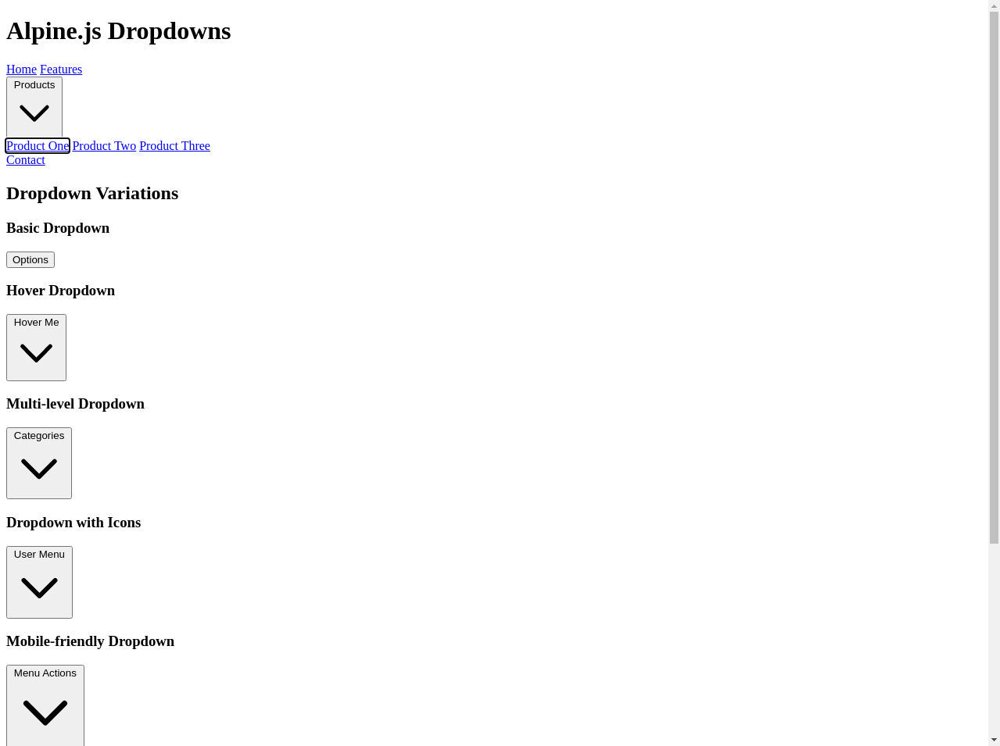

# Alpine.js Dropdown Demo

A lightweight, accessible dropdown solution using Alpine.js with multiple variations and modern UI design.



## Features

- **Lightweight**: Built with Alpine.js (only ~8KB minified and gzipped)
- **No Build Steps**: Add to any project without complex build configurations
- **Accessible**: Keyboard navigation, proper ARIA attributes, and focus management
- **Mobile Responsive**: Works seamlessly on all device sizes
- **Multiple Variations**: 6 different dropdown styles for various use cases
- **Modern UI**: Clean, modern design using Tailwind CSS
- **Customizable**: Easy to modify and extend for your specific needs

## Demo Variations

This demo includes the following dropdown variations:

1. **Basic Dropdown**: Simple click-to-open dropdown menu
2. **Hover Dropdown**: Opens on mouse hover for quick access
3. **Multi-level Dropdown**: Nested dropdown menus for hierarchical data
4. **Dropdown with Icons**: Enhanced visual cues with SVG icons
5. **Mobile-friendly Dropdown**: Optimized for touch devices with responsive positioning
6. **Dropdown with Dividers**: Organized sections with dividing lines

## Installation

### Option 1: Quick Start with CDN

Add Alpine.js and the dropdown component to your HTML:

```html
<!-- Alpine.js from CDN (recommended to use a specific version in production) -->
<script defer src="https://unpkg.com/alpinejs@3.12.0/dist/cdn.min.js"></script>

<!-- Optional: Add the dropdown component script -->
<script src="path/to/alpine-dropdowns.js"></script>
```

### Option 2: NPM Installation

1. Clone this repository:
   ```bash
   git clone https://github.com/yourusername/alpine-dropdown-demo.git
   cd alpine-dropdown-demo
   ```

2. Install dependencies:
   ```bash
   npm install
   ```

3. Build the project:
   ```bash
   npm run build
   ```

## Usage

### Basic Dropdown

```html
<div x-data="{ open: false }" class="relative">
  <button @click="open = !open" class="btn">
    Options
  </button>
  
  <div x-show="open" @click.away="open = false" class="dropdown-menu">
    <a href="#">Option 1</a>
    <a href="#">Option 2</a>
    <a href="#">Option 3</a>
  </div>
</div>
```

### Enhanced Dropdown with Transitions

```html
<div x-data="dropdown()" class="relative">
  <button @click="toggle()" class="btn">
    Menu
    <svg :class="{'rotate-180': arrowRotation}" class="icon">
      <!-- Arrow icon path -->
    </svg>
  </button>
  
  <div 
    x-show="open" 
    x-transition:enter="dropdown-transition dropdown-enter"
    x-transition:enter-end="dropdown-enter-active"
    x-transition:leave="dropdown-transition dropdown-leave"
    x-transition:leave-end="dropdown-leave-active"
    @click.away="close()"
    class="dropdown-menu"
  >
    <a href="#" class="dropdown-item" @keydown.arrow-down.prevent="$el.nextElementSibling?.focus()">Item 1</a>
    <a href="#" class="dropdown-item" @keydown.arrow-up.prevent="$el.previousElementSibling?.focus()" @keydown.arrow-down.prevent="$el.nextElementSibling?.focus()">Item 2</a>
    <a href="#" class="dropdown-item" @keydown.arrow-up.prevent="$el.previousElementSibling?.focus()">Item 3</a>
  </div>
</div>
```

### Hover Dropdown

```html
<div x-data="dropdown({ hoverBehavior: true })" class="relative">
  <button class="btn">
    Hover Me
  </button>
  
  <div 
    x-show="open" 
    x-transition:enter="dropdown-transition dropdown-enter"
    x-transition:enter-end="dropdown-enter-active"
    x-transition:leave="dropdown-transition dropdown-leave"
    x-transition:leave-end="dropdown-leave-active"
    class="dropdown-menu"
  >
    <!-- Dropdown content -->
  </div>
</div>
```

## Dropdown Component API

The `dropdown()` component accepts an options object with the following properties:

| Option | Type | Default | Description |
|--------|------|---------|-------------|
| `hoverBehavior` | Boolean | `false` | Whether dropdown opens on hover |
| `position` | String | `'bottom'` | Position of dropdown menu |
| `closeOnClick` | Boolean | `true` | Whether to close dropdown when an item is clicked |

## Accessibility Features

- Proper ARIA attributes (`aria-haspopup`, `aria-expanded`)
- Keyboard navigation (arrow keys, escape to close)
- Focus management for keyboard users
- Proper contrast ratios for text
- Mobile-friendly touch targets

## Browser Support

- Chrome (latest)
- Firefox (latest)
- Safari (latest)
- Edge (latest)
- Mobile browsers (iOS Safari, Android Chrome)

## Contributing

Contributions are welcome! Please feel free to submit a Pull Request.

## License

This project is licensed under the MIT License - see the LICENSE file for details.

## Acknowledgments

- [Alpine.js](https://alpinejs.dev/) for the lightweight JavaScript framework
- [Tailwind CSS](https://tailwindcss.com/) for the utility-first CSS framework
